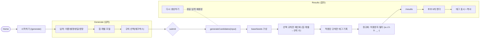

# HipHandle — 힙한 SNS 아이디 생성기

이름/별명/생일/좋아하는 문장을 바탕으로, **선택한 규칙만** 조합해 트렌디한 아이디 후보를 만들어 주는 웹앱입니다. 결과에는 적용된 **규칙 태그**가 함께 표시되며, 클릭 한 번으로 복사할 수 있어요.

---

## 1. 소개 및 개요

- **프로젝트 기간**: **2025.08.19 ~ 2025.09.07**  
- **배포 URL**: **https://hiphandle.netlify.app/**

**프로젝트 설명**

- 입력값(이름/별명/생일/좋아하는 문장)과 **힙 레벨(변형 강도)**, 그리고 **체크한 규칙**을 기반으로 아이디를 생성  
- **선택한 규칙만 적용**하여 후보를 만들며, 정리용 규칙(특수문자 최소화/자음 정리)도 **선택한 경우에만** 포함  
- 각 후보에는 실제로 적용된 **규칙 태그**가 표시되고, **복사 버튼**으로 손쉽게 사용  
- **Zustand**로 입력/결과를 보존하여 라우팅 간 상태 유지  
- **상단 베너(Topbar)** 를 입력 화면과 결과 화면에서 공통 사용

---

## 2. 기술 및 개발 환경

- **Frontend**: React, TypeScript, React Router, CSS Modules  
- **상태 관리**: Zustand  
- **유틸/API**: Clipboard API (복사)  
- **기타**: classnames/clsx

### TypeScript를 사용한 이유

- **규칙 파이프라인의 타입 안전성**  
  규칙 ID를 `RuleId` 유니온, 구현을 `Record<RuleId, Rule>`로 관리해 **누락/오타를 컴파일 타임에 차단**.
- **예측 가능한 리팩터링**  
  규칙/필드명 변경 시 타입이 전역 참조를 추적해 **IDE 리네임만으로 안전하게 수정**.
- **컴포넌트·스토어 계약 보장**  
  컴포넌트 props와 Zustand 스토어 구조를 타입으로 고정하여 **런타임 형태 오류 사전 방지**.
- **자동완성과 자기 문서화**  
  `InputPayload`, `Candidate`, `Rule` 시그니처가 코드 문서 역할 → **개발 속도·정확도 향상**.
- **테스트 부담 감소 & 회귀 방지**  
  타입 시스템이 기본 형태 검증을 맡아 **단위 테스트는 로직 검증에 집중**, 새 규칙 추가 시 **컴파일 에러가 체크리스트**.

**프로젝트 내 적용 포인트**

- `core/types.ts` : `RuleId`, `InputPayload`, `Candidate`, `Rule` 정의  
- `core/generator.ts` : `Record<RuleId, Rule>` 기반 규칙 체인 구성 & 태그 타입 보장  
- `core/rules/*` : 모든 규칙이 동일 시그니처(`Rule`) 준수  
- `store/generatorStore.ts` : Zustand 상태/액션 타입 명세, 선택자 자동완성  
- 각 컴포넌트 props 타입화 및 `config` 상수에 명시적 타입 부여

---

## 3. 주요 기능

### 입력 & 규칙 선택 (Generate)
- **입력 필드**: 이름, 별명, 생일(YYYY-MM-DD), 좋아하는 문장/단어  
- **힙 레벨**: 0~100 (커질수록 한 후보에 **더 많은 변형 규칙**을 조합)  
- **규칙 선택(체크박스)** — 체크된 규칙만 사용  
  - `initialLetters` 앞글자 따오기  
  - `leet` 알파벳→숫자 치환 (a→4, e→3, i→1, o→0, s→5, t→7, b→8, g→9)  
  - `reverse` 역순  
  - `nickname` 별명 결합(앞/뒤 가변)  
  - `hangulQwerty` 한글→영문자판 매핑(두벌식)  
  - `birthdayInsert` 생일 숫자 삽입(중앙 근처)  
  - `keyboardMash` 인접 키 무작위 치환(확률적)  
  - `minimizeSymbols` 특수문자 최소화  
  - `reduceConsonants` x/z/q 남발 축소  

> 선택 규칙이 비어 있으면 기본값 **`["initialLetters", "nickname"]`** 사용.

### 생성 로직 (Core)
- 입력으로 **씨앗 문자열**을 구성 → **선택한 규칙들만** 섞어 **체인** 적용  
- 실제로 **문자열 변화가 생긴 규칙만 태그** 기록 (정리 규칙은 선택 시 항상 태그 반영)  
- 최종 결과는 **허용 문자만** 남김: `[a-z0-9._-]`

### 결과 (Result)
- 기본 **후보 개수 6개** 생성 (`DEFAULT_CANDIDATE_COUNT = 6`)  
- 각 후보 카드에 **핸들(@handle)** 과 **규칙 태그** 표시  
- **복사 버튼** & 카드 우측 상단 **아이콘 복사** 제공  
- **다시 생성하기**로 동일 입력값 기반 재생성

---

## 4. 프로젝트 구조

> 오른쪽 주석은 각 파일/폴더의 역할 요약입니다.

```
src/
├─ assets/
│  ├─ logo.svg                  # 라이트 로고
│  └─ logodark.svg              # 다크 로고
├─ components/
│  ├─ Button/
│  │  ├─ Button.tsx             # 공통 버튼 컴포넌트(variant/clsx)
│  │  └─ Button.module.css      # 버튼 스타일
│  ├─ Checkbox/
│  │  ├─ Checkbox.tsx           # 규칙 선택용 체크박스
│  │  └─ Checkbox.module.css
│  ├─ Input/
│  │  ├─ TextInput.tsx          # 텍스트 인풋 UI
│  │  └─ TextInput.module.css
│  ├─ Tag/
│  │  ├─ Tag.tsx                # 후보에 표시되는 규칙 태그
│  │  └─ Tag.module.css
│  └─ Topbar/
│     ├─ Topbar.tsx             # 상단 베너(홈 로고/링크)
│     └─ Topbar.module.css
├─ core/
│  ├─ rules/                    # 변형 규칙 모듈
│  │  ├─ initialLetters.ts      # 문장 앞글자 추출
│  │  ├─ leet.ts                # 알파벳→숫자(leet) 치환
│  │  ├─ reverse.ts             # 문자열 역순
│  │  ├─ nickname.ts            # 별명 결합(앞/뒤)
│  │  ├─ hangulQwerty.ts        # 한글→영문 자판 매핑
│  │  ├─ birthdayInsert.ts      # 생일 숫자 삽입
│  │  ├─ keyboardMash.ts        # 인접키 확률 치환
│  │  ├─ minimizeSymbols.ts     # 특수문자/공백 제거
│  │  └─ reduceConsonants.ts    # x/z/q 반복 축소
│  ├─ rules/index.ts            # RuleMap/태그/AllRuleIds
│  ├─ utils/
│  │  ├─ random.ts              # sample/shuffle 유틸
│  │  └─ text.ts                # normalize/기호 제거 등 문자열 유틸
│  ├─ generator.ts              # 🔧 핵심: 후보 생성/체인 적용/정규화
│  └─ types.ts                  # RuleId/InputPayload/Candidate 타입
├─ features/
│  ├─ generator/
│  │  ├─ GeneratorForm.tsx      # 입력 폼(값/규칙 선택/힙 레벨)
│  │  ├─ GeneratorForm.module.css
│  │  ├─ HipLevelSlider.tsx     # 힙 레벨 슬라이더
│  │  ├─ HipLevelSlider.module.css
│  │  ├─ RuleSelector.tsx       # 규칙 체크박스 그룹
│  │  └─ RuleSelector.module.css
│  └─ results/
│     ├─ CandidateCard.tsx      # 후보 카드(복사/태그)
│     ├─ CandidateCard.module.css
│     ├─ CandidatesGrid.tsx     # 후보 그리드 레이아웃
│     ├─ CandidatesGrid.module.css
│     ├─ RerollBar.tsx          # 다시 생성하기 바
│     └─ RerollBar.module.css
├─ hooks/
│  └─ useClipboard.ts           # 클립보드 복사 훅
├─ lib/
│  └─ config.ts                 # DEFAULT_CANDIDATE_COUNT=6 등 상수
├─ routes/
│  ├─ HomePage/
│  │  ├─ HomePage.tsx           # 홈(히어로/CTA/푸터)
│  │  └─ HomePage.module.css
│  ├─ GeneratePage/
│  │  ├─ GeneratePage.tsx       # 생성 페이지(SPA 내 폼)
│  │  └─ GeneratePage.module.css
│  └─ ResultPage/
│     ├─ ResultPage.tsx         # 결과 페이지(Topbar+그리드)
│     └─ ResultPage.module.css
├─ store/
│  └─ generatorStore.ts         # Zustand: 입력/후보/액션
├─ styles/
│  └─ globals.css               # 전역 스타일(리셋/레이아웃 베이스)
├─ App.tsx                      # 라우팅 선언
└─ index.tsx                    # 엔트리(React DOM 마운트)
```

---

## 5. 설치 및 실행

> 이 저장소에는 `src/`만 포함되어 있다고 가정합니다. 아래 방식 중 하나로 셋업하세요.

### A) Vite + React + TS (권장)

```bash
npm create vite@latest my-app -- --template react-ts
cd my-app
rm -rf src && cp -r <이 프로젝트의 src> ./src
npm i react-router-dom zustand classnames
npm run dev
```

### B) CRA(TypeScript 템플릿)

```bash
npx create-react-app my-app --template typescript
cd my-app
rm -rf src && cp -r <이 프로젝트의 src> ./src
npm i react-router-dom zustand classnames
npm start
```

**환경 변수**: 불필요  
**백엔드/외부 API**: 사용하지 않음(순수 프런트 변환 로직)

---

## 6. Flowchart



---

## 7. 향후 개선 방향

- **SNS별 가용성 체크**(중복/금칙어)  
- **프리셋**: 규칙 묶음(“읽기 쉬운/극한 힙/미니멀”)  
- **가중치 스코어링**(발음/가독성/고유성) 및 정렬  
- **퍼머링크 공유·즐겨찾기**(후보 저장)  
- **i18n**(한/영 UI 전환), 접근성 개선(키보드 탐색/대비)

---

## 8. 참고

- `lib/config.ts`  
  - `DEFAULT_CANDIDATE_COUNT = 6` (기본 생성 개수)

- `core/generator.ts` 핵심 포인트  
  - **선택한 규칙만** 섞어 체인 생성  
  - 정리 규칙(`minimizeSymbols`, `reduceConsonants`)은 **선택해야만** 포함  
  - **힙 레벨 → 체인 길이**에 반영 (최소 1개, 앵커 규칙 수 이내)  
  - 최종 문자열을 `[a-z0-9._-]`로 정규화

- `core/rules/*` 태그 매핑  
  - 앞글자/숫자치환/역순/별명/한글자판/생일삽입/키보드매시업/특수최소/자음정리
